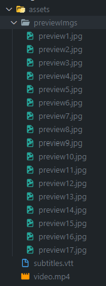

# YouTube Video Player Clone

A clone of the YouTube video player in HTML, CSS and vanilla JavaScript with all the cool features such as volume controls, full screen, theater mode, captions, picture in picture, etc. 😱

You can play any video that you want! Just access the application url: https://pncsoares.github.io/youtube-video-player-clone/src

I added one so you can test the web application but if you want to test it with one video of yours, just follow the instructions below 👇

🙈 No data is collected!

# How to use

1. Start by forking the repository and clone it to your machine, clone instructions [here](#clone-repository)
1. Create a folder called `assets` in the root of the directory
1. Copy the video that you want to use, rename it to `video.mp4` and paste it into `assets` folder
   -  If you have subtitles, rename the file to `subtitles.vtt` and add it into the same folder
1. Download and install `ffmpeg` so you be able to run the next command. You can follow [this](https://www.geeksforgeeks.org/how-to-install-ffmpeg-on-windows/) tutorial to install it in Windows computer.
1. Delete all the files inside `assets/previewImages` folder
1. Open terminal and execute the following command
   ```bash
   ffmpeg -i assets/video.mp4 -vf fps=1/10,scale=120:-1 assets/previewImages/preview%d.jpg
   ```
1. Open the app in the browser following this steps:
   - Expand `src` directory
   - Right click on `index.html` file
   - Chose `Open with Live Server` (If you don't have the extension Live Server installed, you can find it [here](https://marketplace.visualstudio.com/items?itemName=ritwickdey.LiveServer))
1. The final result will be something like this:

   

## Command explanation

### `ffmpeg`
Framework that decode, encode, transcode, mux, demux, stream, filter and play pretty much anything that humans and machines have created. Read the official documentation [here](https://ffmpeg.org/about.html).

### `-i assets/video.mp4`
Set the input as our video.

### `-vf`
Declare that we want to use video filters.

### ` fps=1/10`
Set the video filter with a rate of 1 frame every ten seconds.

### `scale=120:-1`
Set the preview image width to 120px and the height to be automatically scaled.

### `assets/previewImages/preview%d.jpg`
Set the output as the folder named `assets/previewImages/`. The `%d` will increment the number by one every time there is created a new file.

# Checklist

- [x] Play
- [x] Pause
- [x] Change volume
- [x] Move forward
- [x] Move backwards
- [x] Playback speed
- [x] Captions
- [x] Full screen
- [x] Theater mode
- [x] Picture in picture

# Technologies

- [HTML](https://developer.mozilla.org/en-US/docs/Web/HTML)
- [CSS](https://developer.mozilla.org/en-US/docs/Web/CSS)
- [JavaScript](https://developer.mozilla.org/en-US/docs/Web/JavaScript)

# Setup

## Clone repository

Create and go to the directory where you want to place the repository

```bash
  cd my-directory
```

Clone the project

```bash
  git clone https://github.com/pncsoares/youtube-video-player-clone.git
```

Go to the project directory

```bash
  cd youtube-video-player-clone
```

Open in Visual Studio Code

```bash
  code .
```

# License

MIT